# Embedding Search Flow Diagrams

**Visual representations of NornicDB's embedding search architecture.**

## Complete Search Flow

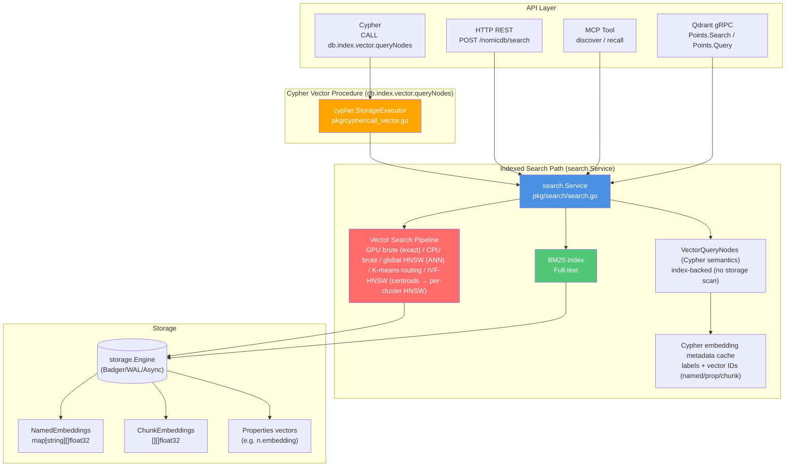

## Vector Strategy Selection (GPU brute → HNSW)

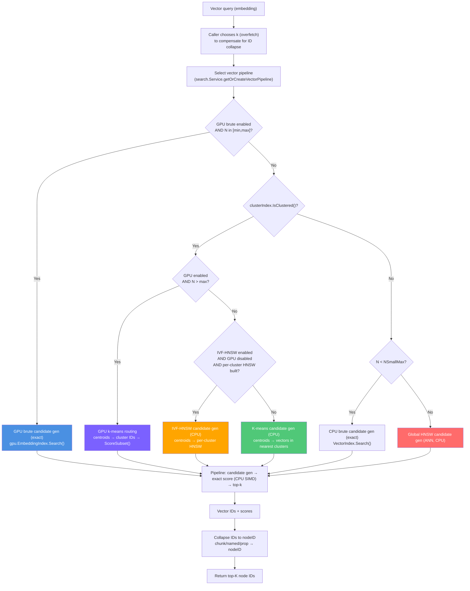

## Embedding Storage Model

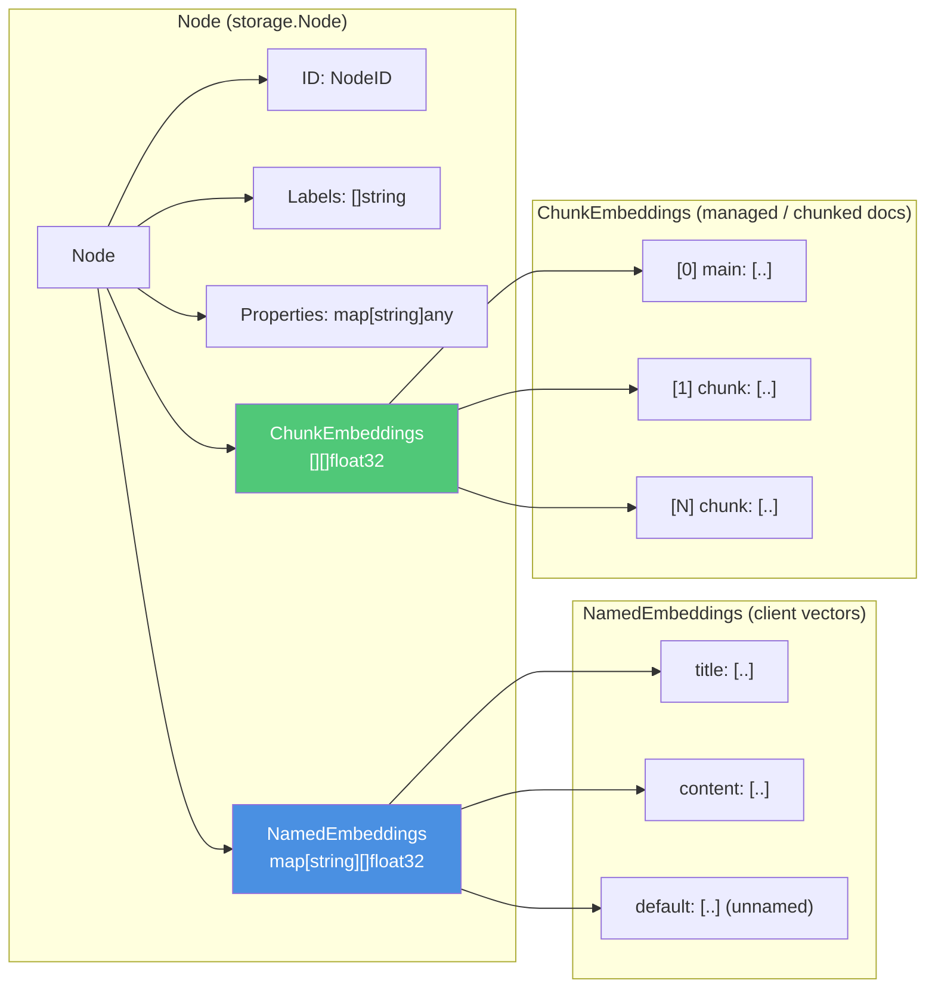

## Search Priority Order

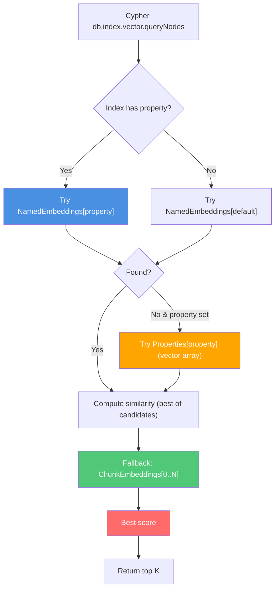

## Indexing Flow

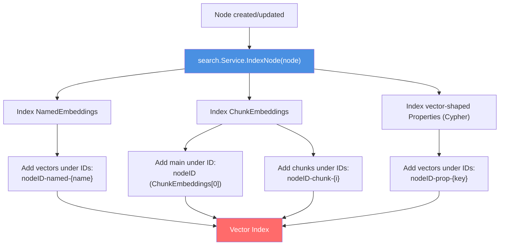

## API Request Flow

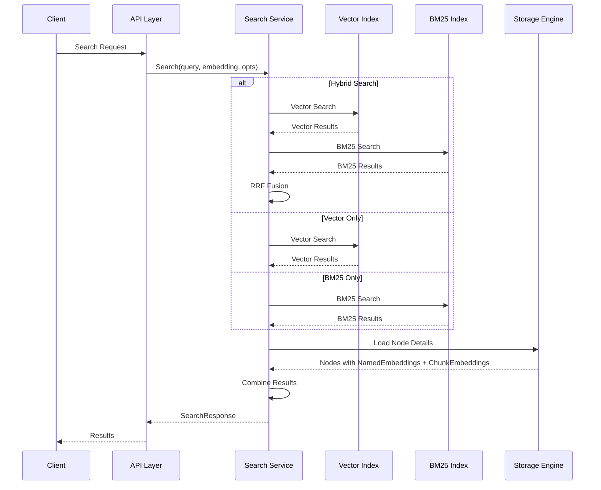

## Collection Architecture

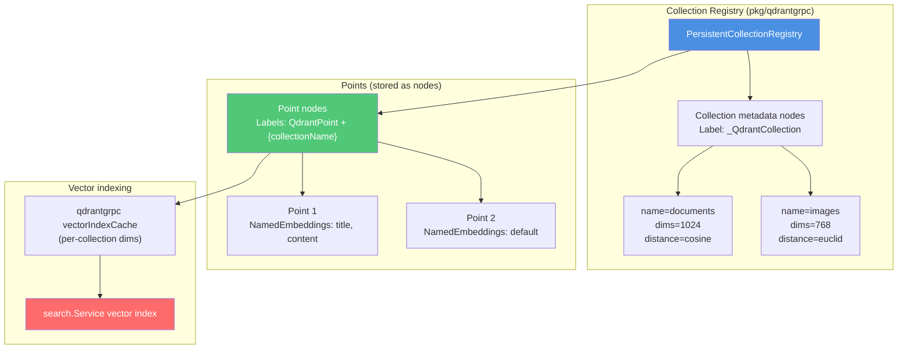

## Hybrid Search (RRF) Flow

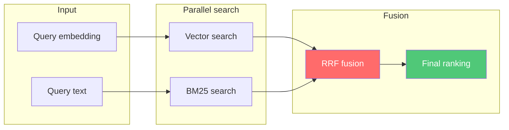

## Cypher Vector Query Flow

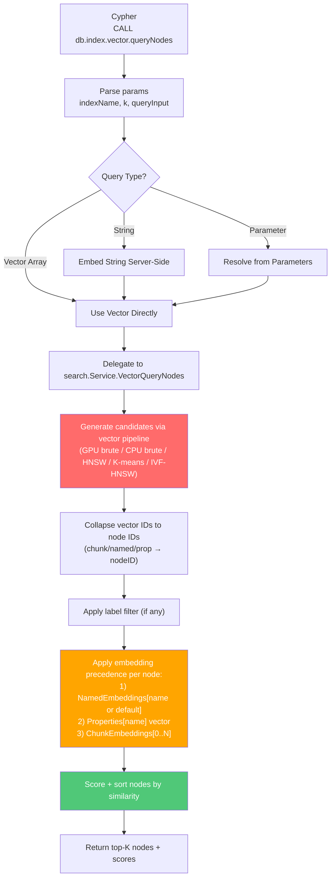

## Complete Embedding Search Coverage

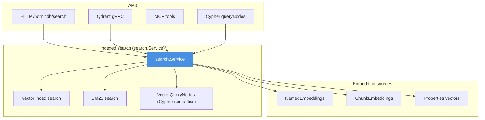

## NornicDB vs Pure Solutions

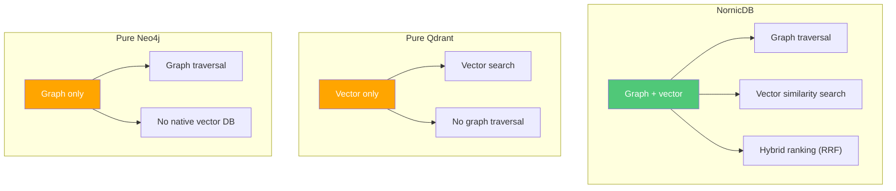

---

## Key Takeaways

1. All vector search entrypoints route through `search.Service` (including Cypher `db.index.vector.queryNodes`)
2. Qdrant gRPC vectors live in `NamedEmbeddings` only; `ChunkEmbeddings` is reserved for chunked/managed embeddings
3. The vector pipeline auto-selects GPU brute / CPU brute / global HNSW / K-means routing / IVF-HNSW depending on runtime + dataset state
4. Cypher `queryNodes` uses indexed candidate generation + in-memory metadata to preserve embedding precedence (no storage scans in steady-state)
5. Hybrid search combines vector similarity with BM25 keyword matching (RRF), then enriches results from storage
