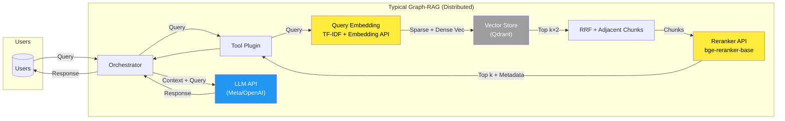
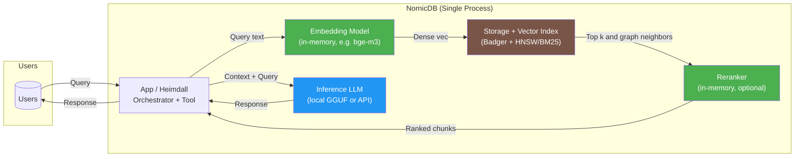
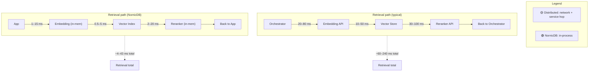
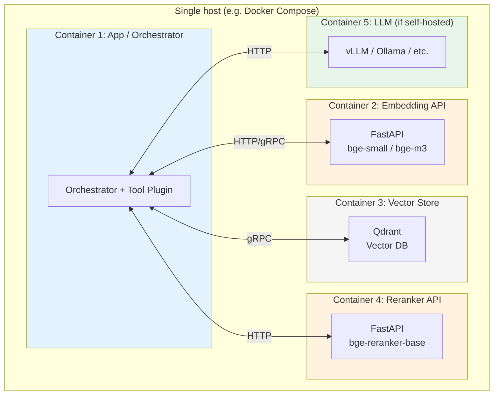
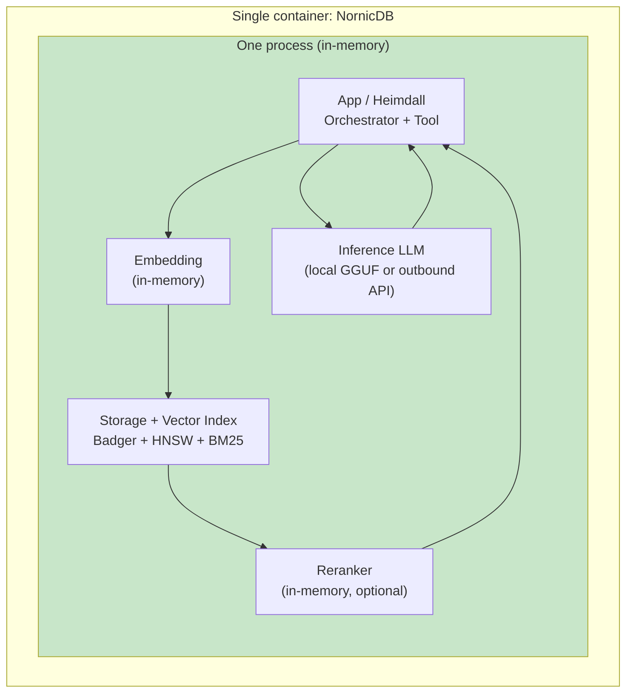
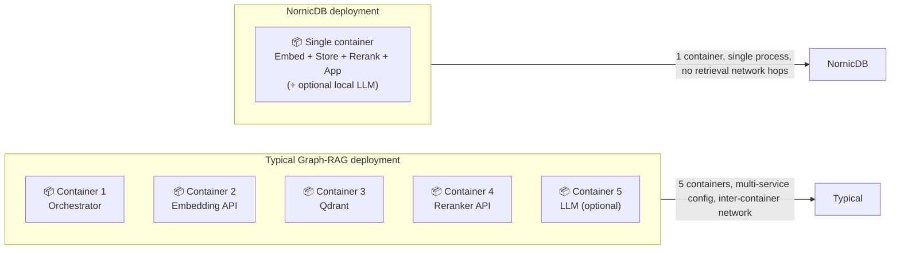

# Graph-RAG: Typical Distributed vs NornicDB In-Memory

This document compares a **typical distributed Graph-RAG architecture** (separate services for embedding, reranking, vector store, and LLM) with **NornicDB’s unified in-process design**, and summarizes the **latency reduction** when all three model roles (embedding, reranker, inference) run in memory in a single process.

---

## Typical Distributed Graph-RAG (Reference)

Multiple network hops: Orchestrator → Tool Plugin → Embedding API → Vector Store → Reranker API → LLM. Each arrow implies serialization, network RTT, and often queueing.

**Latency (typical ballpark per request):**

| Step | Service | Est. latency (network + compute) |
|------|---------|----------------------------------|
| 1 | Orchestrator → Tool Plugin | 1–5 ms |
| 2 | Query → Embedding API (e.g. FastAPI bge-small) | 20–80 ms |
| 3 | Vectors → Vector Store (Qdrant) retrieval | 10–50 ms |
| 4 | Chunks → Reranker API (e.g. FastAPI bge-reranker) | 30–100 ms |
| 5 | Reranked context → Orchestrator | 1–5 ms |
| 6 | Context + Query → LLM API (generation) | 200–2000+ ms |
| **Total (retrieval path)** | **~60–240 ms** (before LLM) | |
| **Total (full request)** | **~260–2240+ ms** | |

---

## NornicDB: Single-Process Graph-RAG (Simplified)

Embedding, vector search (+ optional BM25), reranking, and graph traversal live in the same process as the application. The inference LLM can be local (e.g. GGUF) in the same host or a separate API; when local, “all 3 LLMs” (embedder, reranker, inference) are in-memory / on-box.

**Latency (in-process, no network between components):**

| Step | Component | Est. latency (in-process) |
|------|-----------|----------------------------|
| 1 | Query → Embedding (same process) | 1–15 ms |
| 2 | Vector + BM25 search (local index) | 0.5–5 ms |
| 3 | Graph traversal (depth 1, same store) | 0.5–3 ms |
| 4 | Rerank (same process, optional) | 2–20 ms |
| 5 | Context + Query → LLM (local or API) | 200–2000+ ms (unchanged if API) |
| **Total (retrieval path)** | **~4–43 ms** | |
| **Total (full request, local LLM)** | **~204–2043 ms** (LLM dominates) | |

---

## Side-by-Side Latency Comparison

| Metric | Typical distributed | NornicDB in-memory |
|--------|----------------------|--------------------|
| **Retrieval path (embed → search → rerank)** | ~60–240 ms | ~4–43 ms |
| **Latency reduction (retrieval)** | — | **~5–15× lower** (ballpark) |
| **Network hops (retrieval)** | 3–4 (embed, store, rerank) | 0 |
| **All 3 “LLMs” (embed, rerank, infer)** | Separate services/APIs | Embed + rerank in-process; infer local or API |

---

## Deployment: Containers and Services

Typical Graph-RAG uses **multiple discrete services**, each often run in its own container with its own process, networking, and scaling. NornicDB collapses retrieval (embedding, vector store, reranker, graph) into **one in-memory process** deployable as a **single Docker container**.

### Typical Graph-RAG: Multiple Containers

Each logical service typically runs in a separate container; the orchestrator and tool plugin may share a container, but embedding, vector store, reranker, and (if self-hosted) the LLM each add at least one container.

| # | Container / service | Role |
|---|----------------------|------|
| 1 | App / Orchestrator | Request handling, tool plugin, orchestration |
| 2 | Embedding API (e.g. FastAPI) | Query + chunk embedding (bge-small / bge-m3) |
| 3 | Vector Store (e.g. Qdrant) | Vector + optional sparse index, persistence |
| 4 | Reranker API (e.g. FastAPI) | Cross-encoder reranking (bge-reranker) |
| 5 | LLM (if self-hosted) | vLLM, Ollama, or similar for generation |
| **Total** | **5 containers** (4 if LLM is external API) | |

### NornicDB: Single Container, Single Process

All retrieval components run in **one process** inside **one container**: embedding model, vector/BM25 index, optional reranker, graph storage, and (if configured) local inference LLM. No inter-container networking for the retrieval path.

| # | Container / process | Contents |
|---|----------------------|----------|
| 1 | **NornicDB** (single container, single process) | Orchestrator, Tool Plugin, Embedding, Vector Index + BM25, Graph Store (Badger), Reranker (optional), local LLM (optional) |
| **Total** | **1 container** | All retrieval + optional local inference in one deployable unit |

### Side-by-Side: Container Count and Complexity

| Aspect | Typical Graph-RAG | NornicDB |
|--------|--------------------|----------|
| **Containers (min)** | 4 (orchestrator, embedding, vector store, reranker) | 1 |
| **Containers (with self-hosted LLM)** | 5 | 1 |
| **Processes (retrieval path)** | 4+ (one per service) | 1 |
| **Inter-service networking** | Yes (HTTP/gRPC between containers) | No (in-process only) |
| **Config / env** | Multiple images, ports, envs, health checks | Single image, one port, one env |
| **Scaling** | Scale each service independently (more ops) | Scale single container (simpler) |

---

## Summary

- **Typical Graph-RAG:** Orchestrator, Tool Plugin, Embedding API, Vector Store (e.g. Qdrant), Reranker API, and LLM API are separate; each step adds network and serialization cost. **Deployment** usually means **4–5 containers** (orchestrator, embedding API, vector store, reranker, and optionally self-hosted LLM), each with its own image, port, and config.
- **NornicDB:** Embedding model, vector/BM25 index, optional reranker, and graph storage run in **one process**; retrieval is in-process and much faster. When inference is also local (e.g. GGUF), all three model roles (embedding, reranking, inference) are in-memory on the same machine. **Deployment** is a **single Docker container** (one process, one port, no inter-container networking for retrieval).
- **Latency:** Retrieval path drops from roughly **60–240 ms** to **4–43 ms** in the NornicDB case; end-to-end latency is then dominated by the inference LLM (same as in the distributed setup if both use the same LLM API or local model).
- **Ops simplification:** One container and one process to deploy, scale, and monitor instead of 4–5; no retrieval-path networking or cross-service health checks.
