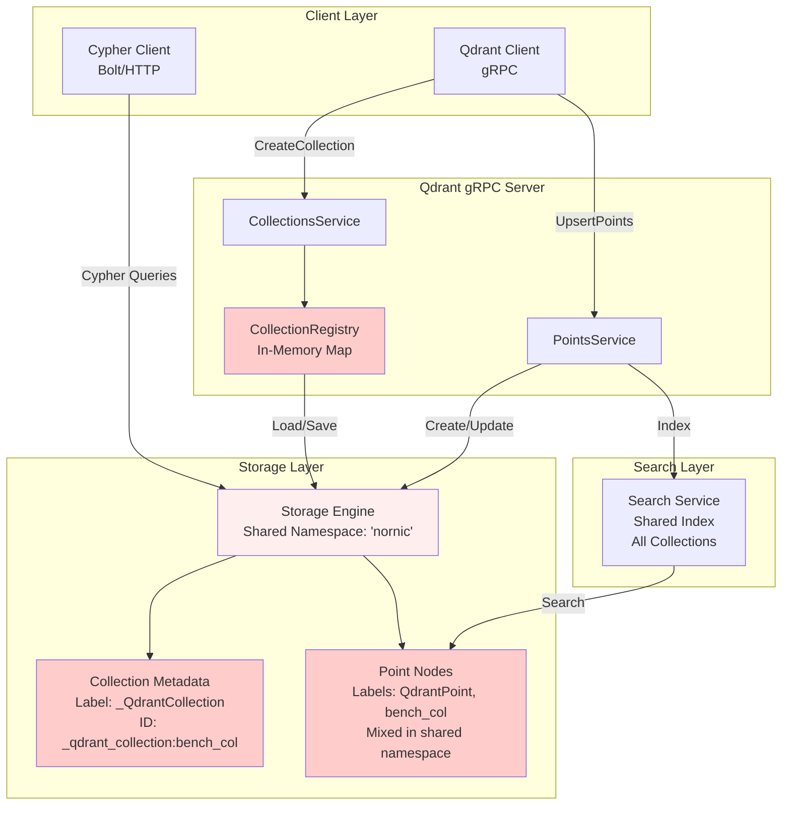
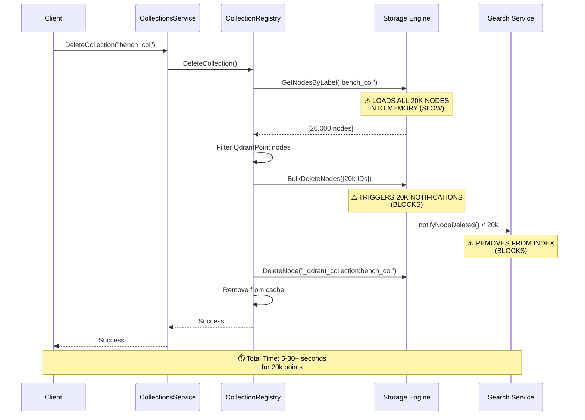
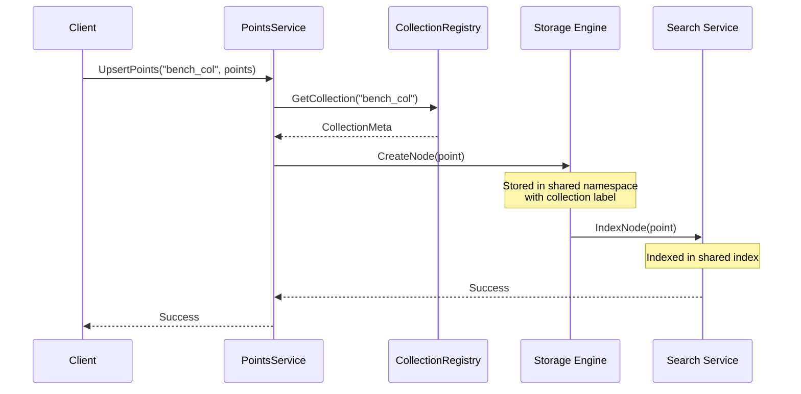
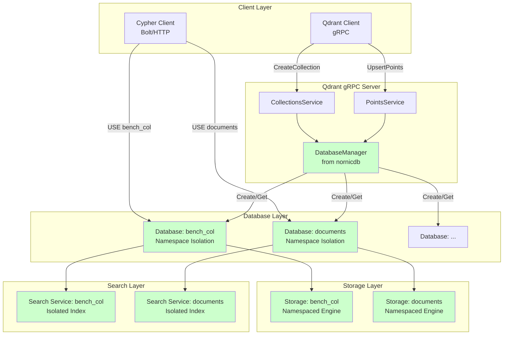
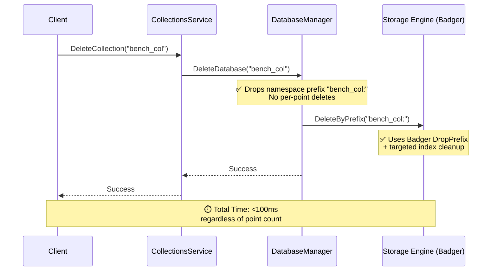
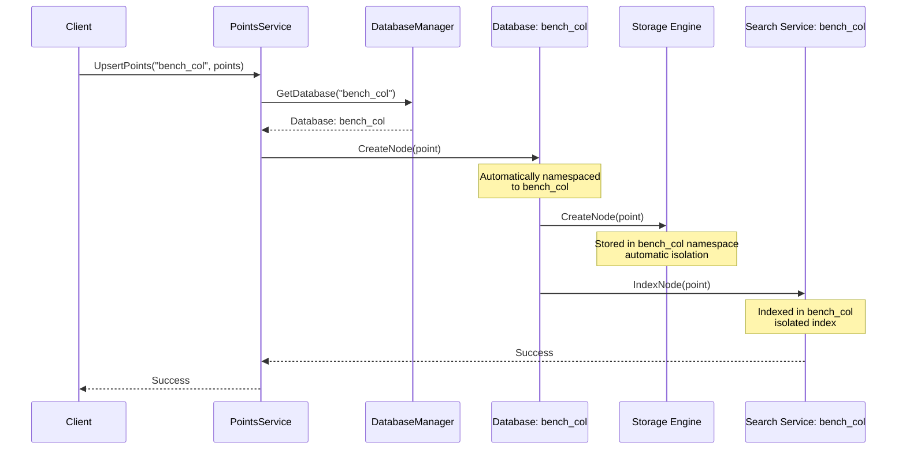
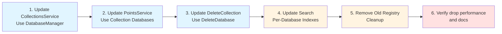

# Qdrant Collection-to-Database: Architecture Diagrams

## Overview

This document provides detailed visual diagrams comparing the legacy collection-based architecture (removed) with the current database-based architecture (what exists today in code).

## Breakage Policy (Explicit)

- No migration.
- No backwards compatibility.
- Only databases created via the new `CreateCollection` flow (i.e., containing `_collection_meta`) are treated as Qdrant collections.

---

## Legacy Architecture (Before, removed)

### High-Level Component Diagram



### Data Storage Structure

```
Storage Engine (Namespace: 'nornic')
│
├── Collection Metadata Nodes
│   ├── _qdrant_collection:bench_col
│   │   └── Properties: {name: "bench_col", dimensions: 1024, distance: "Cosine"}
│   ├── _qdrant_collection:documents
│   │   └── Properties: {name: "documents", dimensions: 768, distance: "Cosine"}
│   └── ...
│
└── Point Nodes (All Collections Mixed)
    ├── point-1
    │   ├── Labels: ["QdrantPoint", "bench_col"]
    │   ├── NamedEmbeddings: {"default": [0.1, 0.2, ...]}
    │   └── Properties: {payload data}
    ├── point-2
    │   ├── Labels: ["QdrantPoint", "bench_col"]
    │   └── ...
    ├── point-1000
    │   ├── Labels: ["QdrantPoint", "documents"]
    │   └── ...
    └── ...
```

### Collection Delete Flow (Current - SLOW)



### Point Upsert Flow (Current)



---

## Current Architecture (After, implemented)

### High-Level Component Diagram



### Data Storage Structure

```
Storage Engine (Multi-Database)
│
├── Database: "bench_col" (Collection = Database)
│   ├── _collection_meta (Required)
│   │   ├── Label: _CollectionMeta
│   │   └── Properties: {dimensions: 1024, distance: "Cosine", schema_version: 1}
│   │
│   └── Point Nodes (Isolated in bench_col namespace)
│       ├── point-1
│       │   ├── NamedEmbeddings: {"default": [0.1, 0.2, ...]}
│       │   └── Properties: {payload data}
│       ├── point-2
│       └── ... (20k points, all in bench_col namespace)
│
├── Database: "documents" (Another Collection)
│   ├── _collection_meta
│   └── Point Nodes (Isolated in documents namespace)
│       └── ...
│
└── Database: "nornic" (Default, non-Qdrant)
    └── Regular graph nodes
```

### Node ID Hygiene (Current)

- Namespace isolates by collection; point IDs must not embed the collection name.
- Reserve `_collection_meta` and all IDs starting with `_` for internal metadata nodes.
- Point node IDs use `qdrant:point:<raw-id>` (collection name is not embedded; the database namespace already scopes it).
- `_collection_meta` is reserved for metadata; IDs beginning with `_` are reserved for internal nodes.

### Collection Delete Flow (Current - FAST)



### Point Upsert Flow (Proposed)



---

## Comparison Matrix

| Aspect                    | Before (Collection Registry)   | After (Database-Based)        |
| ------------------------- | ------------------------------ | ----------------------------- |
| **Storage**               | Shared namespace, label-based  | Namespaced per collection     |
| **Isolation**             | Label filtering                | Namespace isolation           |
| **Delete Performance**    | O(n) - scan all nodes          | O(1) - delete namespace       |
| **Collection Management** | Separate registry              | DatabaseManager               |
| **Cypher Access**         | ❌ No direct access            | ✅ `USE collection MATCH (n)` |
| **Metadata Storage**      | Metadata nodes in shared space | Optional metadata node in DB  |
| **Search Index**          | Shared index, label filtering  | Per-database isolated indexes |
| **Scalability**           | Single shared index            | Per-collection indexes        |
| **Complexity**            | Registry + Storage             | Just DatabaseManager          |

---

## Data Flow: Collection Creation

### Before

```
CreateCollection("bench_col")
    ↓
CollectionRegistry.CreateCollection()
    ↓
Storage.CreateNode(metadataNode)
    ├── ID: "_qdrant_collection:bench_col"
    ├── Label: "_QdrantCollection"
    └── Properties: {name, dimensions, distance}
    ↓
Registry.collections["bench_col"] = meta
```

### After

```
CreateCollection("bench_col")
    ↓
DatabaseManager.CreateDatabase("bench_col")
    ↓
Database created with namespace "bench_col"
    ↓
(Optional) Store metadata node in database
    ├── ID: "_collection_meta"
    ├── Label: "_CollectionMeta"
    └── Properties: {dimensions, distance}
```

---

## Data Flow: Point Query

### Before

```
SearchPoints("bench_col", query)
    ↓
SearchService.Search(query, embedding)
    ↓
Search in shared index (all collections)
    ↓
Filter results by label "bench_col"
    ↓
Return filtered results
```

### After

```
SearchPoints("bench_col", query)
    ↓
DatabaseManager.GetDatabase("bench_col")
    ↓
Database.GetSearchService()
    ↓
SearchService.Search(query, embedding)
    ↓
Search in bench_col index (already isolated)
    ↓
Return results (no filtering needed)
```

---

## Benefits Visualization

### Performance Improvement

```
Delete Collection (20,000 points):

Before:  ████████████████████████████████ 30+ seconds
After:   █  <100ms

Improvement: 300x+ faster
```

### Memory Isolation

```
Before:
┌─────────────────────────────────┐
│  Shared Search Index            │
│  - All collections mixed        │
│  - 20k points from bench_col    │
│  - 10k points from documents    │
│  - 5k points from other         │
└─────────────────────────────────┘

After:
┌──────────────────┐  ┌──────────────────┐  ┌──────────────────┐
│ bench_col Index   │  │ documents Index  │  │ other Index      │
│ - 20k points      │  │ - 10k points    │  │ - 5k points      │
│ Isolated          │  │ Isolated        │  │ Isolated         │
└──────────────────┘  └──────────────────┘  └──────────────────┘
```

### Query Capabilities

```
Before:
┌─────────────────────────────────────┐
│  Qdrant gRPC API                    │
│  ✅ Search within collection        │
│  ❌ No Cypher access                 │
│  ❌ No cross-collection queries      │
└─────────────────────────────────────┘

After:
┌─────────────────────────────────────┐
│  Qdrant gRPC API                    │
│  ✅ Search within collection        │
│  ✅ Cypher access (NEW!)            │
│  ✅ Cross-collection queries (NEW!) │
│  ✅ Graph queries on points (NEW!)  │
└─────────────────────────────────────┘
```

---

## Deployment Strategy

```
Deployment: Clean Break
┌─────────────────────────────────────┐
│  1. Remove CollectionRegistry         │
│  2. Remove PersistentCollectionRegistry│
│  3. Update all services to use       │
│     DatabaseManager                   │
│  4. All collections = databases      │
└─────────────────────────────────────┘

Note: Existing collections will not be migrated.
They will need to be recreated as databases.
```

---

## Example: Querying Collections via Cypher

### Before: Not Possible

```cypher
-- ❌ Can't query collections directly
-- Must use Qdrant gRPC API
```

### After: Full Cypher Support

```cypher
-- ✅ Query points in a collection
USE bench_col
MATCH (n)
RETURN n
LIMIT 10

-- ✅ Vector search in collection
USE bench_col
CALL db.index.vector.queryNodes('embeddings', 10, 'machine learning')
YIELD node, score
RETURN node, score

-- ✅ Filter by properties
USE bench_col
MATCH (n)
WHERE n.category = 'technology'
RETURN n

-- ✅ Create relationships between points
USE bench_col
MATCH (p1:Point), (p2:Point)
WHERE p1.id = 'point-1' AND p2.id = 'point-2'
CREATE (p1)-[:SIMILAR_TO {score: 0.95}]->(p2)

-- ✅ Cross-collection queries (NEW!)
CALL {
  USE bench_col
  MATCH (n) RETURN 'bench_col' AS db, count(n) AS c
  UNION ALL
  USE documents
  MATCH (n) RETURN 'documents' AS db, count(n) AS c
}
RETURN db, c
```

---

## Implementation Sequence



---

## Risk Assessment

| Risk                              | Impact | Mitigation                                                  |
| --------------------------------- | ------ | ----------------------------------------------------------- |
| Breaking Qdrant API compatibility | High   | Keep API surface unchanged; update mapping tests and docs   |
| Performance regression            | Medium | Benchmark + profile; optimize drops and hot search paths    |
| Unexpected name validation edge   | Medium | Validate collection/database names; reserved names rejected |

---

## Success Metrics

After refactoring, we should see:

1. **Delete Performance**: Collection delete <100ms (vs 5-30+ seconds)
2. **Query Performance**: Same or better (namespace isolation = automatic filtering)
3. **Memory Usage**: Similar or better (better isolation = can free per-collection)
4. **Code Complexity**: Reduced (remove registry, use existing DatabaseManager)
5. **Feature Completeness**: ✅ Cypher access to collections (new capability)

---

## Next Steps

1. **Review this plan** with the team
2. **Prototype** database-based collection creation
3. **Benchmark** delete performance improvement
4. **Implement** Phase 1 (foundation)
5. **Test** thoroughly before full rollout
