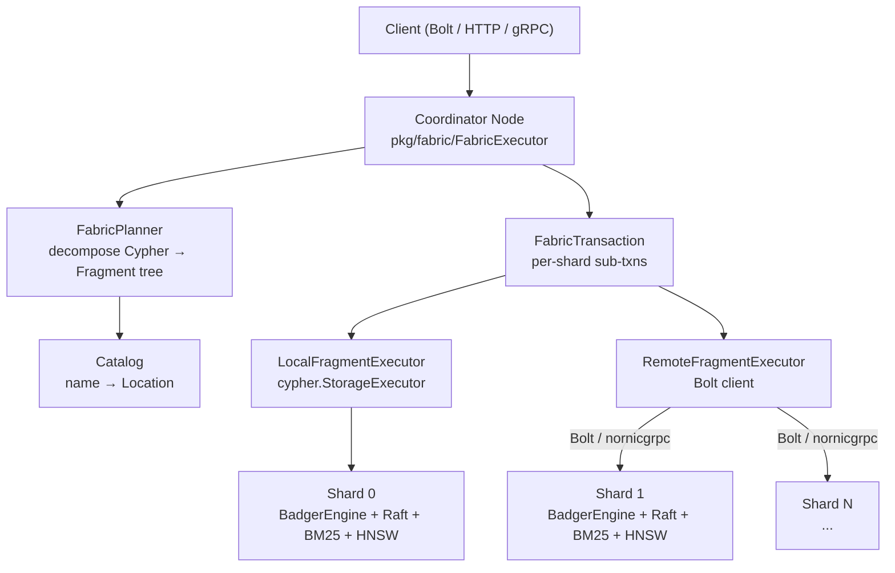

---
name: NornicDB Fabric Distributed Architecture
overview: Implement a Neo4j Fabric-equivalent distributed query layer for NornicDB by mapping each Fabric Java/Scala component to a new Go `pkg/fabric/` package, wiring it into the existing `CompositeEngine`, `multidb`, and `replication` infrastructure to enable horizontal scale-out across multiple NornicDB nodes.
todos:
  - id: phase1-remote-engine
    content: "Implement pkg/storage/remote_engine.go: RemoteEngine implementing storage.Engine over Bolt, wire into ConstituentRef{Type:remote} in pkg/multidb/"
    status: pending
  - id: phase2-fragment
    content: "Implement pkg/fabric/fragment.go: FragmentInit, FragmentLeaf, FragmentExec, FragmentApply, FragmentUnion types"
    status: pending
  - id: phase2-catalog
    content: "Implement pkg/fabric/catalog.go + location.go: Catalog graph registry, LocalGraph/RemoteGraph, LocationLocal/LocationRemote"
    status: pending
  - id: phase2-planner
    content: "Implement pkg/fabric/planner.go: FabricPlanner.Plan() decomposing Cypher into Fragment tree at USE-clause boundaries"
    status: pending
  - id: phase2-executor
    content: "Implement pkg/fabric/executor.go: FabricExecutor walking Fragment tree, dispatching to local_executor.go or remote_executor.go"
    status: pending
  - id: phase2-transaction
    content: "Implement pkg/fabric/transaction.go: FabricTransaction tracking per-shard sub-transactions with commit/rollback coordination"
    status: pending
  - id: phase2-remote-exec
    content: "Implement pkg/fabric/remote_executor.go: RemoteFragmentExecutor sending Cypher fragments over Bolt to remote shards"
    status: pending
  - id: phase3-shard-router
    content: "Implement pkg/fabric/shard_router.go: consistent-hash ShardRouter implementing multidb.RoutingStrategy"
    status: pending
  - id: phase4-distributed-search
    content: Extend IVFHNSWCandidateGen clusterHNSWLookup to call remote shard search endpoints; maintain global centroid catalog at coordinator
    status: pending
  - id: phase5-admin-api
    content: "Add pkg/server/server_cluster.go: GET/POST/DELETE /admin/cluster/shards, GET/POST/DELETE /admin/databases/{name}/constituents, POST/GET /admin/cluster/rebalance, GET /admin/cluster/topology. Extend ConstituentRef with URI+Credentials fields."
    status: pending
  - id: phase5-ui-cluster-page
    content: "Add ui/src/pages/ClusterTopology.tsx: shard registry panel (register/deregister + health polling), topology panel (composite DB to constituent map), rebalance panel (trigger + SSE progress). Register route /cluster in App.tsx and add nav link in PageLayout.tsx."
    status: pending
  - id: phase5-ui-databases-extend
    content: "Extend ui/src/pages/Databases.tsx: composite type badge on DB cards, expandable constituent list with health dots, extend create-DB modal with Standard/Composite toggle and constituent builder with test-connection per remote row."
    status: pending
---

# NornicDB Fabric — Distributed Scale-Out Architecture

## What Neo4j Fabric Does (from source)

Neo4j Fabric is the distributed query layer inside `community/fabric/`. It introduces five key abstractions:

1. **`Fragment`** — A sealed ADT representing a query plan tree produced by decomposing a Cypher statement at `USE graph.name` boundaries. Subtypes: `Init` (entry, empty row), `Leaf` (raw clauses before binding), `Exec` (bound, executable unit), `Apply` (sequential: feed input rows into inner), `Union` (parallel: merge lhs and rhs).

2. **`Location`** — Where an `Exec` fragment runs: `Location.Local` (this node) or `Location.Remote` (another node, identified by URI).

3. **`Catalog`** — The registry of all known graphs. Each graph has an `id`, a name, and resolves to a `Location`.

4. **`FabricExecutor`** — Walks the Fragment tree. For each `Exec`, looks up its `Location` via the catalog, then calls either `FabricLocalExecutor` (runs Cypher against local engine) or `FabricRemoteExecutor` (sends the Cypher string over Bolt to a remote node).

5. **`FabricTransaction`** — Tracks one open sub-transaction per participating shard, coordinates commit/rollback.

`CommunityLocationService.locationOf()` always returns `Location.Local` — the enterprise `EnterpriseLocationService` returns `Location.Remote` for cross-cluster databases. That is the only enterprise divergence.

## How Existing NornicDB Pieces Map

| Neo4j Concept | NornicDB existing | Gap |

|---|---|---|

| `Fragment` plan tree | nothing | new `pkg/fabric/fragment.go` |

| `FabricPlanner` | `cypher.Executor` (single-graph) | new `pkg/fabric/planner.go` |

| `Location.Local` | `CompositeEngine` + local `Engine` | already works |

| `Location.Remote` | `ConstituentRef{Type:"remote"}` — stubbed TODO | new `pkg/storage/remote_engine.go` |

| `Catalog` | `multidb.DatabaseManager` | extend with graph registry |

| `FabricExecutor` | `CompositeEngine` (partial — no Fragment tree) | new `pkg/fabric/executor.go` |

| `FabricTransaction` | `cypher/transaction.go` BEGIN/COMMIT | extend to multi-shard |

| `LocationService` | `multidb.RoutingStrategy` (label/property) | extend: add consistent-hash shard router |

| `FabricRemoteExecutor` | nothing | new Bolt client in `pkg/fabric/remote_executor.go` |

| Per-shard HA | full Raft stack in `pkg/replication/` | no changes needed |

## Architecture Diagram



## New Package: `pkg/fabric/`

Mirrors `org.neo4j.fabric` one-for-one.

### `fragment.go`

Direct translation of `Fragment.scala`. The Fragment tree is the core data structure.

```go
type Fragment interface{ fragment() }

type FragmentInit   struct { Use string; ArgumentColumns, ImportColumns []string }
type FragmentLeaf   struct { Input Fragment; Clauses []string; OutputColumns []string }
type FragmentExec   struct { Input Fragment; Query string; Use string; OutputColumns []string; IsWrite bool }
type FragmentApply  struct { Input Fragment; Inner Fragment; OutputColumns []string }
type FragmentUnion  struct { Input FragmentInit; LHS, RHS Fragment; Distinct bool }
```

### `catalog.go`

Mirrors `Catalog.scala`.

```go
type GraphLocation interface{ graphLocation() }
type LocalGraph  struct { ID int64; DBName string }
type RemoteGraph struct { ID int64; DBName string; URI string; Credentials string }

type Catalog struct {
    graphs map[string]GraphLocation   // name → location
    mu     sync.RWMutex
}
func (c *Catalog) Register(name string, loc GraphLocation)
func (c *Catalog) Resolve(name string) (GraphLocation, error)
```

Populated from `multidb.DatabaseManager` on startup; updated when shards are added/removed via admin API.

### `location.go`

Mirrors `Location.java`.

```go
type Location interface{ location() }
type LocationLocal  struct { DBName string }
type LocationRemote struct { DBName string; URI string }
```

### `planner.go`

Mirrors `FabricPlanner.scala`. Parses the query string (using the existing NornicDB parser), finds `USE graph.name` clauses to determine which Fragment(s) to produce. Without `USE` clauses, a single `FragmentExec` is produced targeting the session database — identical to the community edition behavior.

```go
type FabricPlanner struct { catalog *Catalog }

func (p *FabricPlanner) Plan(query string, sessionDB string) (Fragment, error)
```

For the first implementation, `Plan` returns a single `FragmentExec` targeting the session database for queries with no `USE` clause, and correctly splits queries that contain `USE shard.name` clauses.

### `executor.go`

Mirrors `FabricExecutor.java`. Walks the Fragment tree and dispatches each `FragmentExec` based on `Location`.

```go
type FabricExecutor struct {
    catalog  *Catalog
    local    LocalFragmentExecutor
    remote   RemoteFragmentExecutor
}

func (e *FabricExecutor) Execute(ctx context.Context, tx *FabricTransaction, fragment Fragment, params map[string]any) (*ResultStream, error)
// Dispatches: FragmentInit → empty row; FragmentExec → local or remote;
//             FragmentApply → sequential pipeline; FragmentUnion → parallel merge
```

### `transaction.go`

Mirrors `FabricTransaction.java`. Tracks one sub-transaction per shard, coordinates 2PC commit.

```go
type FabricTransaction struct {
    subTxns map[string]SubTransaction   // shardName → open sub-txn
    mu      sync.Mutex
}
// GetOrOpen(shardName) SubTransaction
// Commit() / Rollback()
```

Phase 1 constraint (matches Neo4j community behavior): at most one **write** shard per FabricTransaction. Reads can span all shards.

### `local_executor.go`

Wraps existing `cypher.StorageExecutor`. No new logic, just the interface adapter.

### `remote_executor.go`

Mirrors `FabricRemoteExecutor.java`. Opens a Bolt connection to the remote shard and sends the Cypher fragment as a string.

```go
type RemoteFragmentExecutor struct {
    pool *BoltConnectionPool   // reuse existing bolt client infra
}

func (r *RemoteFragmentExecutor) Execute(ctx context.Context, loc LocationRemote,
    query string, params map[string]any, tx SubTransaction) (*ResultStream, error)
```

Uses the existing `pkg/bolt/` client types. Each remote call is just `RUN query / PULL` over Bolt — no new wire protocol needed.

## Critical New File: `pkg/storage/remote_engine.go`

Implements `storage.Engine` by forwarding all calls to a remote NornicDB node over Bolt. This directly fills the `ConstituentRef{Type:"remote"}` TODO in [`pkg/multidb/composite.go`](pkg/multidb/composite.go) and lets `CompositeEngine` span machines without any changes to CompositeEngine itself.

```go
type RemoteEngine struct {
    uri    string
    client *bolt.Client
}
// Implements storage.Engine by translating every method into a Cypher statement:
// CreateNode → CREATE (:labels {props}) RETURN id(n)
// GetNode    → MATCH (n) WHERE id(n)=$id RETURN n
// ... etc.
```

## New File: `pkg/fabric/shard_router.go`

Consistent-hash shard routing. Implements `multidb.RoutingStrategy` and plugs directly into the existing `CompositeRouting` chain.

```go
type ShardRouter struct {
    shards []string   // ordered shard names
    ring   *consistentHash
}
// RouteWrite: hash(nodeID or first property value) → shard name
// RouteQuery: if nodeID is known → single shard; else → nil (fan-out all)
```

## Distributed Vector Search

No new packages needed. `IVFHNSWCandidateGen` in [`pkg/search/ivf_hnsw_candidate_gen.go`](pkg/search/ivf_hnsw_candidate_gen.go) already accepts a `clusterHNSWLookup` function. For remote shards, that function calls the shard's `/nornicdb/search` HTTP endpoint and returns candidates. The existing RRF fusion in `search.go` merges them.

```go
// In service setup, for each remote shard:
gen.SetClusterSelector(func(ctx context.Context, query []float32, n int) []int {
    return hybridRouter.SelectClusters(query, n)   // existing HybridClusterRouter
})
// clusterHNSWLookup per cluster-id calls the remote shard's search endpoint
```

## Phased Implementation

- **Phase 1 — Remote Engine**: `pkg/storage/remote_engine.go` + wire into `ConstituentRef{Type:"remote"}` in `pkg/multidb/`. This alone enables `CompositeEngine` to span multiple machines. Every existing composite-DB query immediately fans out across real shards.

- **Phase 2 — Fabric Package**: `pkg/fabric/` (fragment, catalog, location, planner, executor, transaction, local_executor, remote_executor). Enables explicit `USE shard.name` routing and proper multi-shard transaction tracking.

- **Phase 3 — Consistent-Hash Router**: `pkg/fabric/shard_router.go`. Enables automatic write placement without requiring `USE` in every query.

- **Phase 4 — Distributed Vector Search**: Extend `IVFHNSWCandidateGen.clusterHNSWLookup` to call remote shard search endpoints. Global centroid catalog maintained by the coordinator.

- **Phase 5 — Shard Management API + UI**: Full admin API and Bifrost UI for registering/deregistering shards, composite database creation with remote constituents, rebalance control, and cluster health monitoring. Detail below.

## Phase 5 — Shard Management API + UI

### Backend: `pkg/server/server_cluster.go`

New file following the existing `server_dbconfig.go` pattern. All routes registered in [`pkg/server/server_router.go`](pkg/server/server_router.go) under `auth.PermAdmin`.

**Shard Registry**

```
GET  /admin/cluster/shards              → list all registered shards + health
POST /admin/cluster/shards              → register a new remote shard
DELETE /admin/cluster/shards/{name}     → deregister a shard
GET  /admin/cluster/shards/{name}/health → point-in-time health for one shard
```

**Composite database constituent management** (extends existing `/admin/databases/` prefix already registered at line 185 of `server_router.go`):

```
GET  /admin/databases/{name}/constituents           → list constituents with health
POST /admin/databases/{name}/constituents           → add a constituent to an existing composite DB
DELETE /admin/databases/{name}/constituents/{alias} → remove a constituent
```

**Rebalance**

```
POST /admin/cluster/rebalance           → trigger a rebalance across shards
GET  /admin/cluster/rebalance/status    → streaming SSE progress (nodes moved, ETA)
```

**Topology**

```
GET  /admin/cluster/topology            → full cluster map: shards → composite DBs → constituent roles
```

**JSON shapes** (extend existing `DatabaseInfo` and `ConstituentRef` types):

```go
// Extended ConstituentRef (pkg/multidb/composite.go) — add URI + Credentials
type ConstituentRef struct {
    Alias        string `json:"alias"`
    DatabaseName string `json:"database_name"`
    Type         string `json:"type"`         // "local" | "remote"
    AccessMode   string `json:"access_mode"`  // "read" | "write" | "read_write"
    URI          string `json:"uri,omitempty"`         // e.g. "nornic://10.0.0.1:7687"
    Credentials  string `json:"credentials,omitempty"` // base64 user:pass
}

// New response types
type ShardInfo struct {
    Name      string `json:"name"`
    URI       string `json:"uri"`
    Status    string `json:"status"`   // "healthy" | "degraded" | "unreachable"
    LatencyMs int    `json:"latency_ms"`
    NodeCount int64  `json:"node_count"`
    EdgeCount int64  `json:"edge_count"`
}

type ConstituentHealth struct {
    ConstituentRef
    Status    string `json:"status"`
    LatencyMs int    `json:"latency_ms"`
    NodeCount int64  `json:"node_count,omitempty"`
}

type ClusterTopology struct {
    Shards     []ShardInfo                       `json:"shards"`
    Composites map[string][]ConstituentHealth    `json:"composites"` // db name → constituents
}

type RebalanceStatus struct {
    Running       bool    `json:"running"`
    NodesMoved    int64   `json:"nodes_moved"`
    NodesTotal    int64   `json:"nodes_total"`
    ProgressPct   float64 `json:"progress_pct"`
    EtaSeconds    int     `json:"eta_seconds,omitempty"`
    CurrentShard  string  `json:"current_shard,omitempty"`
}
```

Also extend `DatabaseInfo` in `ui/src/utils/api.ts`:

```ts
export interface ConstituentInfo {
  alias: string;
  databaseName: string;
  type: 'local' | 'remote';
  accessMode: 'read' | 'write' | 'read_write';
  uri?: string;
  status: 'healthy' | 'degraded' | 'unreachable';
  latencyMs?: number;
  nodeCount?: number;
}

export interface DatabaseInfo {
  // ... existing fields ...
  type?: 'standard' | 'composite';
  constituents?: ConstituentInfo[];  // only present when type === 'composite'
}
```

### UI: New Page `ui/src/pages/ClusterTopology.tsx`

New route `/cluster` registered in [`ui/src/App.tsx`](ui/src/App.tsx). Follows the same `PageLayout` + `PageHeader` + `Modal` pattern as [`ui/src/pages/Databases.tsx`](ui/src/pages/Databases.tsx) and [`ui/src/pages/DatabaseAccess.tsx`](ui/src/pages/DatabaseAccess.tsx).

**Three sections on one page:**

**1 — Shard Registry panel**

- Table: shard name | URI | status badge (green/yellow/red) | latency | node count | actions
- "Register Shard" button → modal: name, URI, credentials, test-connection button before save
- Per-row deregister button with confirmation modal
- Auto-refreshes health every 30 seconds (same polling pattern as search readiness ETA in `Databases.tsx`)

**2 — Cluster Topology panel**

- Read-only map showing which composite databases span which shards
- Expandable rows: composite DB name → constituent list with health badges
- "Add Constituent" action per composite DB → modal: shard picker (dropdown of registered shards), alias, access mode

**3 — Rebalance panel**

- "Trigger Rebalance" button (disabled when rebalance is running)
- Progress bar + ETA when running (SSE stream from `/admin/cluster/rebalance/status`)
- Last rebalance timestamp

### UI: Extend `ui/src/pages/Databases.tsx`

- Add `type` badge to each database card: "composite" shown as a secondary tag alongside the database name
- For composite databases, add an expandable constituent list beneath the card showing each constituent's alias, URI (if remote), and health dot
- Extend the "Create Database" modal with a toggle: **Standard** / **Composite**
  - When Composite is selected, show a constituent builder: add rows with alias, type (local/remote), local DB picker or URI field, access mode selector
  - "Test Connection" per remote constituent row before submitting
- Add navigation link to `/cluster` in the page action area (icon: `Network` from lucide-react)

### Navigation

Add `/cluster` to the side navigation in [`ui/src/components/common/PageLayout.tsx`](ui/src/components/common/PageLayout.tsx) under the existing admin-only section (alongside `/databases`, `/security`), visible only when the current user has the `admin` role. Icon: `Network` from lucide-react.

## Key Existing Files (no changes needed)

- [`pkg/replication/raft.go`](pkg/replication/raft.go) — HA per shard, untouched
- [`pkg/storage/composite_engine.go`](pkg/storage/composite_engine.go) — parallel fan-out reads already work; Phase 1 just feeds it a `RemoteEngine`
- [`pkg/multidb/routing.go`](pkg/multidb/routing.go) — `RoutingStrategy` interface; `ShardRouter` implements it
- [`pkg/search/ivf_hnsw_candidate_gen.go`](pkg/search/ivf_hnsw_candidate_gen.go) — cluster selector hook already exists

## Critical Constraint (matches Neo4j community Fabric)

- Reads: fan out to all shards, merge results (already works in `CompositeEngine`)
- Writes: route to exactly **one** shard per transaction (consistent with `CommunityLocationService` always returning `Local`)
- Cross-shard relationships: a relationship may reference nodes on different shards; the coordinator resolves them via a second lookup to the remote shard during traversal