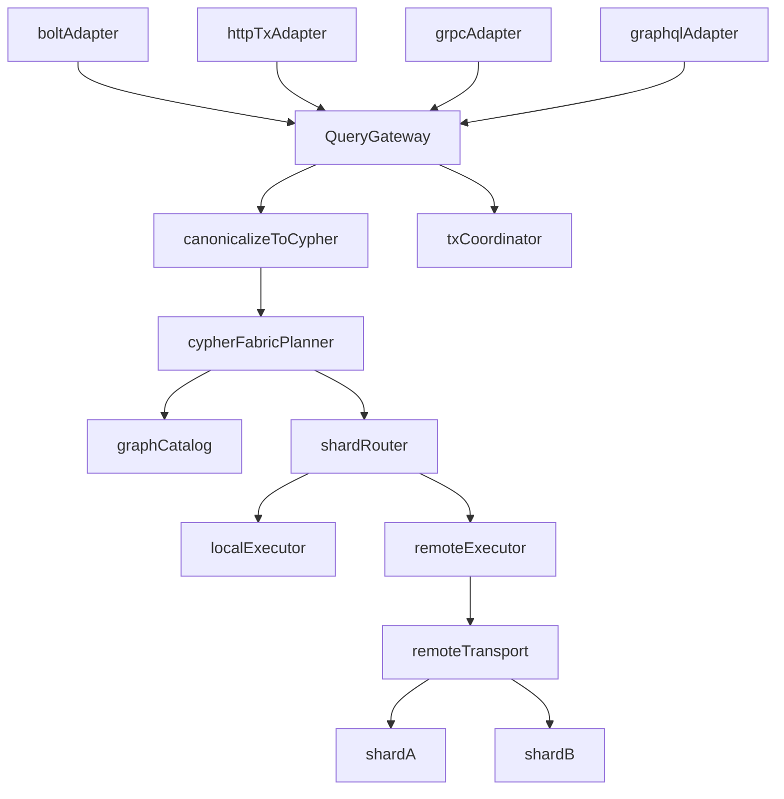

# NornicDB Distributed Fabric Plan (Neo4j-Compat First, Concrete)

## Locked Decisions (No Ambiguity)

- Compatibility target: expand to a Fabric subset (composite + remote routing) while preserving existing supported Neo4j semantics.
- Shared execution architecture: protocol adapters -> `QueryGateway` -> `cypher/fabric` execution core.
- Canonicalization: GraphQL and gRPC requests must be translated to Cypher before execution.
- GraphQL v1 scope: queries, mutations, and subscriptions all must be distributed-aware via QueryGateway.
- gRPC v1 scope: all gRPC RPCs (query, vector, admin) must route through QueryGateway in distributed mode.
- Transport v1: Bolt is primary distributed path; HTTP uses the same gateway and must match response semantics.
- Read fan-out failure: fail whole query on any unavailable shard (no partial rows).
- Multi-shard writes in one tx: reject on second write target with deterministic client error.
- Error contract: use stable Neo4j-style error codes and fixed message templates; tests assert exact code and message.
- Identity at merge boundary: always shard-qualified internal identity (`shardAlias + localID`).
- Merge dedup key: shard-qualified identity only.
- Credential model: store secret references only; resolve via existing cluster-shared JWT/secret mechanism.
- OIDC policy: if OIDC is configured, every node validates locally; on validation failure reject (no fallback). Shared-secret mode only when OIDC is globally disabled/unconfigured.
- Rebalance v1: manual online rebalance with throttling and SSE progress.
- Distributed vector failure policy: Neo4j-aligned strict fail if any selected shard is unavailable, fails, or times out.
- Default runtime profile: align with Neo4j defaults for equivalent settings; avoid stricter hardcoded distributed timeouts by default.
- Release default-on gate: tests + benchmark guardrails + chaos/failure-injection suite must pass.
- Benchmark release block threshold: fail release if p95 latency regresses >10% or throughput drops >10% on core distributed benchmarks.

## Architecture

## Neo4j-Aligned Timeout and Config Profile

- Timeout defaults must align with Neo4j for equivalent settings:
  - `db.transaction.timeout` = `0` (disabled)
  - `db.lock.acquisition.timeout` = `0` (disabled)
  - `server.http.transaction_idle_timeout` = `30s`
  - `server.queryapi.transaction_idle_timeout` = `60s`
  - `db.transaction.bookmark_ready_timeout` = `30s`
  - `dbms.routing_ttl` = `300s`
  - `internal.server.bolt.unauth_connection_timeout` = `30s` (internal)
- Distributed coordinator defaults must not introduce stricter implicit shard/fan-out timeout budgets than the Neo4j-aligned profile above.
- Rebalance remains manually throttled at default `200 ops/s` (configurable override).
- If Neo4j exposes a configuration option relevant to this distributed scope, NornicDB must expose an equivalent option with matching semantics.
- Remote connection settings must support Neo4j-style options where applicable:
  - `connection_timeout`
  - `connection_max_lifetime`
  - `connection_pool_acquisition_timeout`
  - `connection_pool_idle_test`
  - `connection_pool_max_size`
  - `logging_level`
  - `ssl_enforced`

## Phase 0 - Compatibility Baseline

### Deliverables

- Add golden compatibility tests for:
  - core Cypher command envelopes and errors.
  - `/db/{database}/tx*` HTTP transaction semantics.
  - Bolt transaction/query parity against existing behavior.
- Freeze baseline fixtures for pre-distributed behavior.

### Acceptance Criteria

- No behavior changes in single-node mode.
- Golden tests pass before any distributed code path is enabled.

## Phase 1 - QueryGateway and Remote Transport Foundation

### Deliverables

- Add `QueryGateway` package as the only execution entrypoint used by Bolt/HTTP/gRPC/GraphQL adapters.
- Wire GraphQL query/mutation/subscription resolvers to QueryGateway as the execution entrypoint.
- Wire all gRPC RPC handlers to QueryGateway as the execution entrypoint in distributed mode.
- Add `RemoteTransport` abstraction and default implementation used by `RemoteEngine`.
- Extend composite constituent metadata with:
  - `type`, `uri`, `secret_ref`, `access_mode`.
  - no raw credentials in metadata responses.
- Wire remote constituents into multidb storage resolution.

### Acceptance Criteria

- Bolt and HTTP execute distributed queries through the same gateway path.
- gRPC and GraphQL (including GraphQL subscriptions) execute through the same gateway path after Cypher translation.
- Integration test: two shard servers + coordinator; remote constituent read fan-out works.

## Phase 2 - Shard Routing and Distributed Dispatch

### Deliverables

- Implement deterministic shard router.
- Implement catalog-backed local/remote dispatcher.
- Enforce strict read failure behavior on shard unavailability.
- Use fixed error code/message templates for shard timeout and shard unavailable failures.
- Apply shard-qualified identity at merge boundaries.
- Dedup merged rows by shard-qualified identity only.

### Acceptance Criteria

- Same shard key always maps to same shard.
- Query without shard key fans out to all readable shards.
- Any shard timeout/unavailable in fan-out returns deterministic whole-query failure.
- Merge logic cannot collapse rows from different shards with same local ID.

## Phase 3 - Transaction Coordinator Constraints

### Deliverables

- Add tx coordinator enforcing:
  - multiple read shards allowed.
  - exactly one write shard per transaction.
- Add explicit error when second write shard is attempted.
- Use fixed Neo4j-style error code/message template for second-write-shard rejection.

### Acceptance Criteria

- Second write-shard access fails with stable error code/message contract.
- Rollback closes all open sub-transactions.
- Existing local transaction semantics unchanged.

## Phase 4 - Distributed Vector Search

### Deliverables

- Extend remote candidate lookup via existing search hook points.
- Route lookup via shard catalog and health state.
- Enforce Neo4j-aligned strict fail policy if any selected shard is unavailable, fails, or times out.

### Acceptance Criteria

- Search succeeds only when all selected shards respond within configured timeout settings.
- On missing shard/timeout/failure, response is deterministic failure (no partial vector result), matching Neo4j-style distributed query behavior.

## Phase 5 - Cluster Admin API

### Deliverables

- Add admin endpoints for shard registry, topology, constituent ops, rebalance trigger/status.
- Add SSE rebalance progress stream.
- Reuse existing RBAC permissions and require admin scope.
- Redact secret material from all API responses.
- Implement default throttling at 200 ops/s with explicit override field in trigger API.

### Acceptance Criteria

- All endpoints enforce authz and input validation.
- Manual online rebalance supports throttling params and progress reporting.

## Phase 6 - UI and Protocol Surface Integration

### Deliverables

- Add cluster UI page + route.
- Add navigation entry in existing header/navigation surfaces.
- Extend database UI for composite/constituent management.
- Ensure gRPC/GraphQL adapters route through QueryGateway and Cypher canonicalization path.
- Ensure GraphQL subscriptions use the same distributed routing/failure semantics as query/mutation operations.
- Ensure all gRPC RPC categories (query, vector, admin) use shared gateway execution path in distributed mode.

### Acceptance Criteria

- Cluster actions available only to authorized admin users.
- UI state reflects rebalance progress and shard health from API contracts.
- Adapter-level tests prove all protocol surfaces invoke shared gateway execution path.
- Subscription tests prove distributed event/query paths use gateway routing and strict shard-failure behavior.

## Security and Auth Model

- OIDC-enabled cluster:
  - each node validates bearer claims locally against shared issuer/JWKS config.
  - no shared-secret fallback when OIDC validation fails.
- Non-OIDC cluster:
  - shared-secret JWT mode is allowed.
- Secret handling:
  - store `secret_ref` only.
  - resolve runtime credentials/tokens via shared cluster secret mechanism.

## Mandatory Test Matrix

### Unit Tests

- `pkg/fabric/shard_router_test.go`
- `pkg/fabric/executor_test.go`
- `pkg/fabric/transaction_test.go`
- `pkg/storage/remote_engine_test.go` with `MockRemoteTransport`
- `pkg/storage/composite_engine_sharding_test.go` with `FakeEngine`

### Integration Tests

- `pkg/multidb/remote_composite_integration_test.go`
- `pkg/fabric/fabric_query_integration_test.go`
- `pkg/server/server_cluster_test.go`

### Compatibility/Parity Tests

- Bolt vs HTTP equivalent distributed query result/error semantics.
- Existing composite regression suites remain green.
- gRPC/GraphQL adapter tests verify canonicalize-to-Cypher and gateway execution path.
- GraphQL parity tests cover query, mutation, and subscription distributed execution via gateway.
- gRPC parity tests cover query, vector, and admin RPC distributed execution via gateway.

### Perf and Chaos Gates

- Benchmark guardrails for distributed query/search paths.
- Guardrail thresholds: block release if p95 latency >10% regression or throughput >10% regression versus baseline.
- Failure-injection suite for shard timeout, stale topology, retry storms, and coordinator recovery.
- Timeout defaults under test must match the Neo4j-aligned timeout profile in this plan.

## Release Gate (Default Enablement)

Distributed mode may be enabled by default only when all are true:

- Compatibility suites pass.
- Unit + integration suites pass.
- Benchmarks meet guardrails.
- Chaos/failure-injection suites pass.