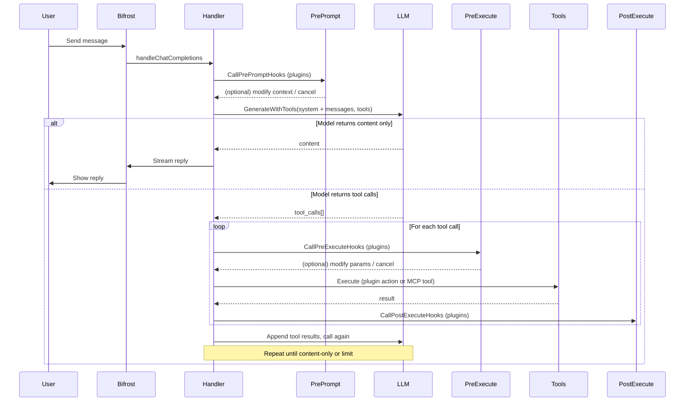

# Heimdall Agentic Loop

The Bifrost chat uses an **agentic loop**: the model can call tools, the server runs them, and the results are fed back so the model can decide the next step or produce a final answer. This guide describes how that loop works and how **Heimdall plugins** hook into it (PrePrompt, PreExecute, PostExecute).

## What is the agentic loop?

When you send a message in Bifrost:

1. **Request** – Your message is sent with the current conversation history to the LLM (local GGUF, Ollama, or OpenAI).
2. **Model output** – The model may return:
   - **Content only** – A direct reply (e.g. “Here are the database stats…”). The loop ends.
   - **Tool calls** – One or more tool invocations (e.g. `heimdall_watcher_query` with a Cypher string, or `store` / `link` if MCP tools are enabled).
3. **Execution** – The server runs each tool **in process** (no external HTTP call for in-memory tools). Results are formatted and appended to the conversation as “tool” messages.
4. **Repeat** – The model is called again with the updated history (user message, assistant tool calls, tool results). It can issue more tool calls or respond with content. This repeats until the model returns content only or a round limit is reached.

So the assistant can **chain** actions: e.g. run a query, then summarize; or store a fact, then link it to another node.

## Tools in the loop

The model only sees tools that are **registered** for the request. Two sources are combined:

### 1. Plugin actions (always present when Heimdall is enabled)

Plugins register **actions** (e.g. `heimdall_watcher_query`, `heimdall_watcher_status`). These are converted to the same shape as MCP tools (name, description, inputSchema) and passed to the model. The handler executes them by dispatching to the plugin that owns the action.

- **Watcher plugin** (bundled) – Query, status, metrics, health, discover, etc.
- **Your plugins** – Custom actions (e.g. `heimdall.myplugin.analyze`) appear as tools with the same name and schema.

### 2. MCP memory tools (opt-in)

When [MCP tools are enabled](heimdall-mcp-tools.md), the loop also gets **store**, **recall**, **discover**, **link**, **task**, **tasks**. These run in process against the same database (no separate MCP HTTP call). You can enable all of them or an allowlist (e.g. only `store` and `link`).

## Flow diagram

## How plugins interact with the loop

Plugins can implement **lifecycle hooks** that run at specific points in the request. These run for **every** Bifrost chat request that reaches the handler (including those that use the agentic loop).

### PrePrompt

- **When**: Before the system prompt is finalized and sent to the LLM.
- **Use**: Inject context, add examples, or **cancel** the request (e.g. policy: “no write actions in this environment”).
- **Data**: `PromptContext` – user message, messages, plugin data, token budget. Plugins can set `PluginData` for use in later hooks.

### PreExecute

- **When**: Before **each** tool execution (plugin action or MCP tool).
- **Use**: Validate parameters, check permissions, **modify params** (e.g. add a default database), or **cancel** this tool call (e.g. “user cannot run delete”).
- **Data**: `PreExecuteContext` – action/tool name, params, request ID, database router, etc. Plugins can return `ModifiedParams` or `AbortMessage`.

### PostExecute

- **When**: After **each** tool execution.
- **Use**: Log results, update internal state, send notifications to the user (e.g. “Query returned 5 rows”).
- **Data**: `PostExecuteContext` – action, duration, success/error, result summary.

Notifications (e.g. `NotifyInfo`, `NotifyError`) from hooks are sent as **streaming chunks** so the user sees them inline in the chat.

## Plugin actions vs MCP tools

| Aspect | Plugin actions | MCP tools (when enabled) |
|--------|----------------|---------------------------|
| **Examples** | `heimdall_watcher_query`, `heimdall_watcher_status` | `store`, `recall`, `discover`, `link`, `task`, `tasks` |
| **Defined by** | Heimdall plugins (Watcher, your .so) | NornicDB MCP server (built-in) |
| **Execution** | Dispatched to plugin’s action handler | Run in process by MCP server (store/recall/link etc.) |
| **Enabled by** | Loading the plugin (Heimdall enabled) | `mcp_enable: true` (+ optional allowlist) |

Both are presented to the model as tools with name, description, and inputSchema. The handler decides whether to call a plugin or the in-memory MCP runner based on the tool name.

## Timeouts

- The HTTP request has a **timeout** (e.g. 300 seconds) so long-running agentic sessions don’t hang indefinitely. The server’s write timeout is tuned to allow multiple tool calls in one request.

## Related documentation

- [Enabling MCP tools in the agentic loop](heimdall-mcp-tools.md) – Turn on store/recall/link etc. and use an allowlist.
- [Heimdall AI Assistant](heimdall-ai-assistant.md) – Configuration, providers, Bifrost UI.
- [Heimdall Plugins](heimdall-plugins.md) – Implementing actions and lifecycle hooks.
- [Event triggers and automatic remediation](heimdall-event-triggers-remediation.md) – Using database events to trigger the model and take actions.
